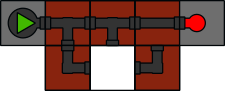

# Cogs

Voor dit project laten we ons inspireren door het puzzelspel [Cogs]. In onze
versie laten we de gebruiker 2-dimensionale schuifpuzzels oplossen. Je moet
echter geen afbeelding in elkaar schuiven, maar een netwerk van buizen zonder
lek.

## Omschrijving van de puzzel

### De stukken

Een schuifpuzzel bestaat uit een vaste rand, op één plekje (de opening) na,
gevuld met vierkante tegels. Op de rand bevinden zich een aantal pompen
("sources") en een aantal ballonnen ("sinks"). Een pomp/ballon kan zich dus op
de linker-, boven-, rechter- of onderrand bevinden en heeft dan respectievelijk
een buis naar rechts, onder, links of boven.

De tegels binnenin de rand kunnen ofwel beweegbaar zijn, ofwel vast liggen. Een
beweegbare tegel kan je in elke richting schuiven, als er plaats is, maar nooit
draaien. Vaste tegels kan je noch verschuiven noch draaien.

Op elke tegel *kan* zich één koppelstuk bevinden. Ze kunnen dus ook gewoon leeg
zijn. Een koppelstuk verbindt 2 of meer zijden van de tegel met elkaar. Alle
mogelijke combinaties kunnen voorkomen.

### Opgelost of niet?

Een puzzel is opgelost als elke ballon opgeblazen wordt. Daarvoor heeft die
ballon minstens een invoerdruk equivalent met 1 pomp nodig. Het is dus niet
voldoende dat elke ballon met een buis verbonden is; er mogen ook geen lekken
zijn onderweg, want daardoor gaat alle druk verloren.

### Invoerformaat

Een wereld wordt omschreven door een bestand dat er als volgt uitziet:

    width: 4
    height: 3
    sources: { (0, 0), (0, 1) }
    sinks: { (2, 3) }
    tiles: { { pos: (0, 0), fixed: no, south: open, west: open }
           , { pos: (0, 2), fixed: no, default: open, west: closed }
           , { pos: (0, 3), fixed: yes, west: open, south: open }
           , { pos: (1, 0), fixed: no, north: open, east: open }
           , { pos: (1, 1), fixed: no, default: open, north: closed }
           , { pos: (1, 2), fixed: no, default: open }
           , { pos: (1, 3), fixed: no, west: open, north: open }
           , { pos: (2, 0), fixed: yes }
           , { pos: (2, 1), fixed: no, north: open, east: open }
           , { pos: (2, 2), fixed: no, default: open, north: closed }
           , { pos: (2, 3), fixed: no, west: open, east: open }
           }

Overeenkomstige grafische wereld:

Enkele algemene omschrijvingen van dit formaat:

* Witruimte, tenzij anders vermeld, bestaat uit horizontale witruimte (spaties
  en tabs) en verticale witruimte (nieuwe regels).

* Een sleutel en zijn waarde worden van elkaar gescheiden door een dubbelpunt
  en horizontale witruimte.

* Een lijst van waarden wordt voorgesteld door de voorstelling van deze
  waarden, gescheiden door witruimte en 1 komma en omringd door accolades (`{`
  vooraan en `}` achteraan de lijst).

* Een coördinaat wordt voorgesteld door twee positieve gehele getallen. Het
  eerste getal stelt de rij voor, het tweede de kolom. De oorsprong `(0, 0)`
  bevindt zich linksboven *binnen* de rand. Tussen de twee getallen staat een
  komma. Na het linkerhaakje, voor de komma, na de komma en voor het
  rechterhaakje staat optioneel horizontale witruimte.

Het formaat zelf:

* Een eerste sleutel "width" met als waarde een geheel getal groter dan 0 stelt
  de breedte van de puzzel voor (rand niet meegerekend). Gevolgd door een
  nieuwe regel.

* Een tweede sleutel "height" met als waarde een geheel getal groter dan 0 stelt
  de hoogte van de puzzel voor (rand niet meegerekend). Gevolgd door een
  nieuwe regel.

* Een derde sleutel "sources" met als waarde een lijst van coördinaten. Deze
  coördinaten beschrijven de tegels waar de pompen *naast* liggen. Ze bevinden
  zich dus binnen de rand terwijl de pompen op de rand liggen. Dubbele waarden
  zijn mogelijk bijvoorbeeld in de linkerbovenhoek. (Twee pompen die op
  `(0, 0)` aansluiten.) Als er maar 1 coördinaat voor een hoek gegeven wordt,
  is er ambiguiteit. We lossen deze op met volgende voorrangsregels: noord, dan
  oost, dan zuid, dan west. Het is dus onmogelijk om een pomp ten westen van
  `(0, 0)` te plaatsen als er nog geen ten noorden ervan ligt!

  Er is altijd minstens 1 pomp aanwezig.

* Een vierde sleutel "sinks" die gelijkaardig aan de "sources" de lijst van
  ballonnen omschrijft. Ook voor ballonnen gelden bovenstaande voorrangsregels.
  De ballonnen worden echter pas *na* de pompen geplaatst.

  Er is altijd minstens 1 ballon aanwezig.

* Een vijfde sleutel "tiles" die een lijst van tegels als waarde heeft. Een
  tegel wordt voorgesteld door een lijst van sleutel/waarde-paren in vaste
  volgorde:

  - Een sleutel "pos" met als waarde de coördinaat van deze tegel.
  - Een sleutel "fixed" met als waarde "yes" of "no", die aangeeft of deze
    tegel een vaste of verschuifbare tegel is.
  - Een optionele sleutel "default" met waarde "open" of "closed" die de
    standaardwaarde voor deze tegel vast legt.
  - Nul of meer sleutel/waarde-paren die weergeven langs welke kanten deze
    tegel een opening heeft. Elke sleutel uit deze paren is uniek.

  Standaard zijn alle zijden van een tegel gesloten (0-stuk). Met een paar
  "default: closed" verandert dit niet, met een paar "default: open" begin je
  vanaf een X-stuk. Daarna volgen enkele uitzonderingen/bevestigingen van
  de standaard. "west: open" zal er bijvoorbeeld voor zorgen dat de linkerkant
  van je tegel open is.

  Er is altijd minstens 1 tegel aanwezig.

Jullie programma moet alle geldige invoer aanvaarden en alle ongeldige invoer
weigeren. Bij onduidelijkheid of iets geldig of ongeldig is, stuur je een
voorbeeld door, waarop ik het als invalid/solved/unsolved zal toevoegen aan
de testgevallen.

## Interface

### Grafisch

Het spel wordt opgestart met een oproep

    stack build --exec 'cogs tests/1.in'

Je speelt het spel door met de muis te klikken op tegels. Klikt de speler op
een tegel op dezelfde rij/kolom als de opening, schuiven alle tegels van de
aangeklikte tegel tot de opening 1 vakje op richting de opening. De nieuwe
opening bevindt zich dan waar de speler klikte. Lukt de gevraagde zet niet,
bijvoorbeeld omdat er een vast vakje tussen de opening en de aangeklikte tegel
lag, of omdat de aageklikte tegel zich niet op dezelfde rij/kolom bevindt als
de opening, wordt de klik gewoon genegeerd.

Hieronder vindt je twee voorbeelden hoe de interactie werkt.

Naast het afbeelden van de tegels, moet je ook nog de pompen en de ballonnen
weergeven. Voor een pomp kan je gewoon een vaste afbeelding gebruiken. Bij een
ballon moet het zichtbaar zijn of deze opgeblazen is of niet.

Een opgeloste puzzel hoef je niet grafisch speciaal weer te geven, die kan je
herkennen omdat alle ballonnen opgeblazen zijn.

### Testen (CLI)

Een test wordt opgestart met een oproep

    stack build --exec 'cogs --test tests/1.in'

Deze oproep geeft weer of de gegeven puzzel correct opgelost is of niet:

    $ stack build --exec 'cogs --test tests/1.in'
    SOLVED
    $ stack build --exec 'cogs --test tests/2.in'
    NOT SOLVED

Enkele voorbeeldwerelden zijn beschikbaar in de [tests](tests) map.

## Vereisten

We voorzien minimale functionele vereisten en uitgebreide functionele
vereisten. Voldoet je project niet aan de minimale functionele vereisten heb je
automatisch een nul voor het project. Indien je in tijdsnood zou raken is het
dus belangrijker om te focussen op het correct implementeren van de spellogica
dan op het voorzien van een grafische interface.

### Minimale Functionele vereisten

* Je code moet het invoerformaat kunnen parsen.
* Je code moet minstens slagen voor de voorziene tests.

### Verdere Functionele vereisten

* Je code moet een grafische interface voorzien.
* Je code moet slagen voor een reeks van uitgebreide tests.

### Niet functionele vereisten

* De parser moet geschreven te worden met een eigen geschreven parser monad,
  je mag hiervoor beginnen van de parser monad die je hebt gezien tijdens de
  hoorcolleges.
* De parser moet gebruik maken van de Error monad om behulpzame parse-fouten
  weer te geven.
* Je dient zelf testen te schrijven die de werking van het spel testen. Je kan
  hier werken met:
  - testen zoals in Sausage Roll
  - [HUnit](https://hackage.haskell.org/package/HUnit), Java-style testen.
  - [QuickCheck](https://hackage.haskell.org/package/QuickCheck)
  - gewoon elke combinatie van bovenstaande gebruiken.
* Je grafische interface moet geïmplementeerd worden met gloss.
* Geen hardgecodeerde constanten in je code.
* Vermijd het gebruik van if-testen, maak gebruik van pattern matching en
  guards.
* Maak gebruik van where clauses voor locale functies.
* Probeer gebruik te maken van de reeds bestaande functies.
* Pas hlint toe op je code. Voldoet je code niet aan de verwachte code stijl
  zal je hiervoor punten verliezen.

Voldoet je code niet aan de verwachte code stijl zal je hiervoor punten
verliezen.

## Praktisch

Voor dit project krijg je geen skeletcode, op de snippet voor het testen
van je code na. Dien in door je project gezipt op te laden naar [indianio].
Wegens gebrek aan ondersteuning voor Haskell, zal Indianio **niet**
controleren of jouw code compileert, dit kan je zelf doen door met een stack
project te werken (dien je aangepaste metafiles mee in!).

Om ons werk te sparen tijdens het verbeteren, zorgen jullie er zelf voor dat
jullie projecten compileren. **Projecten die niet compileren krijgen
automatisch een nul.** Om een "maar op mijn machine werkte het wel..." te
vermijden, kan je altijd je project eens compileren in de standaard Haskell
docker. Loop onderstaand commando met je project als huidige map.

    docker run -it -v $(pwd):/mnt --workdir=/mnt --rm haskell:8 bash -c 'apt-get update; yes | apt-get install freeglut3-dev; stack build --allow-different-user'

Problemen kan je altijd (voor de deadline) melden.

## Dependencies

In dit project maken we gebruik opnieuw gebruik van [gloss], en deze werd al
toegevoegd aan het gegeven cabal bestand. Gebruik je andere bibliotheken, dan
voeg je die ook daar toe (en je dient deze mee in). Vermijd het gebruik van
ongeziene bibliotheken, bij twijfel vraag je even of je jouw favoriete
bibliotheek mag gebruiken.

[indianio]: https://indianio.ugent.be/?action=handinform&id=12211
[gloss]: http://hackage.haskell.org/package/gloss
[Cogs]: http://www.cogsgame.com/
