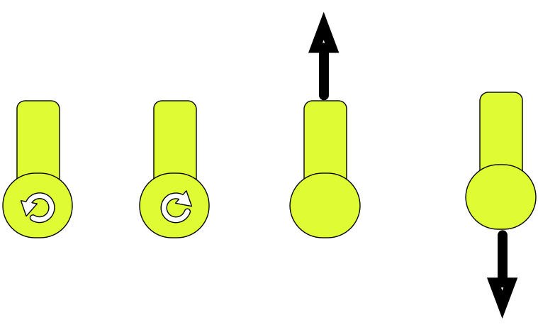
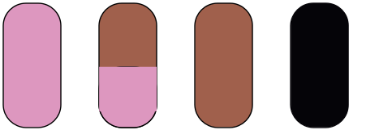
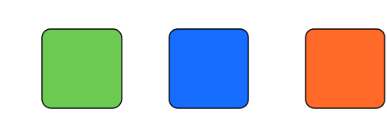
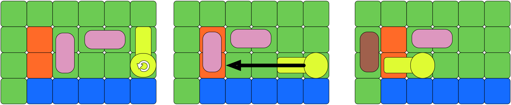

# Sausage Roll

Sausage Roll is een vereenvoudigde 2-dimensionale versie van [Stephen's Sausage
Roll]. Het hoofdpersonage van het spel probeert, slechts gewapend met een
hitte-resistente vork, de worsten in zijn wereld te bakken. Hiervoor duwt en
rolt hij de worsten rond over hete roosters, zonder deze worsten te laten
aanbranden of ze in het water te laten vallen.


## Werking van het spel

Het spel begint met het hoofdpersonage die zich in een grid wereld bevindt.
Elke level bevat een aantal worsten en een aantal roosters. Bedoeling is om
elke worst langs beide zijden te grillen, een worst langs één zijde twee keer
grillen is niet toegestaan.


### Beweegbare objecten in de wereld

- De speler: het hoofdpersonage kan zich draaien en zich vooruit of achteruit
  bewegen. Telkens als hij zich draait kan het zijn dat hij met zijn vork één
  of meerdere worsten verplaatst.

  

- Worsten: worsten bevinden zich in de wereld en kunnen bewogen worden als de
  speler ze duwt met zijn vork. Het is belangrijk om in te zien dat worsten
  ofwel kunnen schuiven of rollen. Als de speler een worst duwt langs de
  zijkant (dwars op de worst) zal deze rollen. Als hij ze echter duwt langs de
  lengte van de worst zullen ze schuiven. Een worst kan zich in heel wat
  verschillende staten bevinden zoals hieronder weergegeven. Niet gebakken,
  langs één zijde voor de helft gebakken, langs één zijde helemaal gebakken, of
  helemaal verbrand langs één zijde, ...

  


### Vaste elementen in de wereld

Er zijn drie verschillende vaste elementen in de wereld:



- Gras: hier kunnen worsten over rollen en schuiven, en kan de speler op lopen.
- Water: De speler kan niet in het water stappen. Worsten kunnen in het water
  vallen (als ze zich volledig boven het water bevinden), waardoor je ze kwijt
  bent en de puzzel faalt.
- Gril: De speler kan hier niet over stappen\*. Als een worst op een
  rooster belandt, zal hij *na de beweging* 1 fase bakken (rauw wordt gebakken,
  gebakken wordt verbrand, verbrand blijft verbrand). Het maakt dus niet uit
  hoe lang een stuk worst op een gril ligt, enkel hoe vaak hij er op terecht
  komt.

\* In het oorspronkelijke spel kan de speler hier wel opstappen, maar zal hij
   onmiddelijk terug naar zijn vorige positie springen. Zo kan je echter wel
   tegen een worst aan de andere kant van de gril duwen. Vrijwillig
   implementeer je dit ook op die manier.


### Voorbeeld

Een voorbeeld van hoe de speler worsten kan doen bewegen is hieronder
weergegeven. In het voorbeeld zijn er twee volledig ongebakken worsten en de
speler.



- In de eerste stap zie je dat de speler zich draait. Hierdoor zal hij tegen de
  eerste worst duwen, deze worst zal schuiven tegen de tweede worst die zal
  rollen op de rooster.
- In de tweede stap zal de speler zich drie vakjes vooruit bewegen waardoor hij
  de tweede worst zal draaien. Gezien deze worst op de hete rooster heeft
  gelegen is deze nu langs één zijde gebakken.


## Inlezen en uitschrijven van je wereld

Om ervoor te zorgen dat jullie code eenvoudig getest kan worden, spreken we een
invoer- en uitvoerformaat af voor de wereld. Het invoerformaat zal een wereld
beschrijven zoals deze er aan de start van het spel uit ziet. Hij zal dus enkel
rauwe worsten bevatten. Het uitvoerformaat bevat naast rauwe worsten ook
gebakken en verbrande worsten. Daarnaast wordt een wereld, die een succesvol
opgeloste puzzel bevat (a.k.a alle worsten zijn aan weerkanten helemaal
gebakken en er is geen enkele worst in het water gevallen), voorgesteld door de
string `"Opgelost!"`.

**Let op**: je code moet **niet** bestand zijn tegen foute invoer. Gebruik deze
informatie om je code te vereenvoudigen!


### Ondergrond

De wereld bestaat uit een 2-dimensionaal grid. Lijnen worden genummerd van
boven naar onder, startend bij 0. Kolommen worden genummerd van links naar
rechts, startend bij 0.

Elke element in het grid is een cel dat bestaat uit twee karakters. De vaste
elementen in de wereld worden voorgesteld door het eerste karakter van elke
cel. Gras, water en gril worden respectievelijk voorgesteld door de karakters
`+`, `~` en `#`. De tweede kolom van elke cel wordt gebruikt om de bewegende
delen van de wereld voor te stellen.

Voorbeeld van een wereld met enkel vaste elementen (elk tweede karakter is een
spatie):

    ~ ~ ~ ~ ~ ~
    ~ + + + + ~
    ~ + # + + ~
    ~ + # # + ~
    ~ + + + + ~
    ~ ~ ~ ~ ~ ~


### Bewegende elementen in de invoer

In het invoerformaat worden worsten voorgesteld door de karakters `⊂`
(horizontaal) en `∩` (verticaal). Beide zijn rauw. In de cel rechts van een `⊂`
zal zich altijd een esthetische `⊃` bevinden. Op dezelfde manier zal zich in de
cel onder een `∩` altijd een `∪` bevinden. Je kan dit tweede karakter gebruiken
als hulp bij het inlezen, maar omdat een worst uniek gedefinieerd wordt door
het eerste kan het misschien eenvoudiger zijn om het gewoon te negeren...

(Opmerking: wie problemen heeft met Unicode, kan ook andere symbolen gebruiken,
zie verder...)

De speler wordt voorgesteld door één van de karakters `N`, `E`, `S` of `W` in
de tweede kolom van de cel. Deze letters geven de richting aan waarin de speler
kijkt, respectievelijk noordelijk (bovenaan het scherm), oostelijk, zuidelijk
of westelijk. In de cel "voor" de speler zal de vork aangeduid worden met het
karakter `x`, maar ook deze informatie heb je niet nodig om de speler in je
wereld te plaatsen.


### Bewegende elementen in de uitvoer

De worsten in het uitvoerformaat worden iets moeilijker om voor te stellen. Een
worst kan namelijk deels gebakken of verbrand zijn. Daarbij kunnen we ook enkel
de bovenkant van een worst afbeelden, want we spelen in bovenaanzicht. Je vindt
de karakters voor de verschillende helften van de worst in de verschillende
maten van gaarheid terug in onderstaande tabel.

|          | noordelijk | oostelijk | zuidelijk | westelijk |
| -------: | :--------: | :-------: | :-------: | :-------: |
| rauw     | `∩`        | `⊃`       | `∪`       | `⊂`       |
| gebakken | `∧`        | `>`       | `∨`       | `<`       |
| verbrand | `⊓`        | `⊐`       | `⊔`       | `⊏`       |

Alternatief, als je problemen hebt met unicode `(invalid character)`, kan je
ook volgende extended ASCII symbolen gebruiken:

|          | noordelijk | oostelijk | zuidelijk | westelijk |
| -------: | :--------: | :-------: | :-------: | :-------: |
| rauw     | `n`        | `)`       | `u`       | `(`       |
| gebakken | `^`        | `>`       | `v`       | `<`       |
| verbrand | `ñ`        | `]`       | `ù`       | `[`       |

Of gewoon deze basis-ASCII karakters:

|          | noordelijk | oostelijk | zuidelijk | westelijk |
| -------: | :--------: | :-------: | :-------: | :-------: |
| rauw     | `n`        | `e`       | `s`       | `w`       |
| gebakken | `1`        | `2`       | `3`       | `4`       |
| verbrand | `a`        | `b`       | `c`       | `d`       |


### Voorbeelden

Hieronder vind je een aantal verschillende werelden. Om overzicht te creëren,
werden deze naast elkaar geplaatst.

```
            ~ ~ ~ ~ ~        ~ ~ ~ ~ ~        
            ~ + + + ~        ~ + # + ~        
invoer      ~ +S+∩~ ~        ~x+W#⊂~⊃~
            ~ +x+∪+ ~        ~ + # + ~        
            ~ ~ ~ ~ ~        ~ ~ ~ ~ ~        

            ~ ~ ~ ~ ~        ~ ~ ~ ~ ~
            ~ ~ ~ + ~        ~ ~ ~<+>~
uitvoer     ~ + #<#⊃~        ~ + #<#⊃~
            ~ +S#⊂~⊃~        ~ +E#x~ ~
            ~ +x+⊂+⊃~        ~ + + +⊂~⊃
            ~ ~ ~ ~ ~        ~ ~ ~ ~ ~
```


## Uitvoeren en testen van je code

Je programma moet twee methoden van aanroep begrijpen. Wordt het aangeroepen
met één argument, is dat argument een bestand met een wereld in. Je start de
grafische interface op en laat het spel spelen. Volgen er na dat eerste
argument nog argumenten, dan start je programma op in test-modus.

Voor het verwerken van deze argumenten is al skeletcode voorzien in
[src/Main.hs](src/Main.hs). Je kan deze natuurlijk aanpassen, maar zorg ervoor
dat de code aan onze invoer blijft voldoen. Hieronder zie je hoe zulke testen
kunnen verlopen:

    $ cat tests/1.in
    ~ ~ ~∩~ ~∩~ ~
    ~ +S+∪+∩+∪+∩~
    ~ ~x~ ~∪~ ~∪~
    $ cat tests/1.steps
    E
    E
    E
    $ stack build --exec 'sausage-roll tests/1.in E E E'
    ~ ~ ~∩~ ~∩~ ~
    ~ +S+∪+∩+∪+∩~
    ~ ~x~ ~∪~ ~∪~

    ~ ~ ~ ~ ~∩~ ~
    ~ +E+x+∩+∪+∩~
    ~ ~ ~ ~∪~ ~∪~

    ~ ~ ~ ~ ~ ~∩~
    ~ + +E+x+∩+∪~
    ~ ~ ~ ~ ~∪~ ~

    ~ ~ ~ ~ ~ ~ ~
    ~ + + +E+x+∩~
    ~ ~ ~ ~ ~ ~∪~

    $

We zien hoe er drie keer "oost" ingegeven wordt, waardoor de speler eerst
draait (en een worst in het water gooit), en dan twee stappen naar het oosten
zet (en bij elke stap nog een worst in het water duwt). De beginwereld en alle
tussentijdse werelden worden afgedrukt. Deze exacte uitvoer bevindt zich ook in
[tests/1.out](tests/1.out).

Als de invoer de speler bijvoorbeeld in het water stuurt, wordt deze
instructie, net zoals in het spel zelf, gewoon genegeerd.

Je kan gebruik maken van de code in [src/Test.hs](src/Test.hs) die deze testen
automatisch zal uitvoeren. Als je `stack build --exec 'sausage-test tests'`
aanroept, zullen alle bestanden die zich in `tests` bevinden uitgevoerd worden.


## Guidelines

We voorzien minimale functionele vereisten en uitgebreide functionele
vereisten. Voldoet je project niet aan de minimale functionele vereisten heb je
automatisch een nul voor het project. Indien je in tijdsnood zou raken is het
dus belangrijker om te focussen op het correct implementeren van de spellogica
dan op het voorzien van een grafische interface.


## Minimale Functionele vereisten

* Je code moet het invoer formaat kunnen parsen
* Alle vaste en beweegbare elementen moeten voorzien zijn
* Je code moet minstens slagen voor de voorziene tests


## Verdere Functionele vereisten

* Je code moet een grafische interface voorzien
* Je code moet slagen voor een reeks van uitgebreide tests


## Praktisch

Voor dit project krijg je geen skeletcode, op de snippet voor het testen
van je code na. Dien in door je project gezipt op te laden naar [indianio].
Wegens gebrek aan ondersteuning voor Haskell, zal Indianio **niet**
controleren of jouw code compileert, dit kan je zelf doen door met een stack
project te werken (dien je aangepaste metafiles mee in!).

Om ons werk te sparen tijdens het verbeteren, zorgen jullie er zelf voor dat
jullie projecten compileren. **Projecten die niet compileren krijgen
automatisch een nul.** Om een "maar op mijn machine werkte het wel..." te
vermijden, kan je altijd je project eens compileren in de standaard Haskell
docker. Loop onderstaand commando met je project als huidige map.

    docker run -it -v $(pwd):/mnt --workdir=/mnt --rm haskell:8 bash -c 'apt-get update; yes | apt-get install freeglut3-dev; stack build --allow-different-user'

Problemen kan je altijd (voor de deadline) melden.


## Niet functionele vereisten

- Je grafische interface moet geimplementeerd worden met gloss.
- Geen hardgecodeerde constanten in je code.
- Vermijd het gebruik van if-testen, maak gebruik van pattern matching en
  guards.
- Maak gebruik van where clauses voor locale functies.
- Probeer gebruik te maken van de reeds bestaande functies.
- Pas hlint toe op je code.

Voldoet je code niet aan de verwachte code stijl zal je hiervoor punten
verliezen.


## Dependencies

In dit project maken we gebruik opnieuw gebruik van [gloss], en deze werd al
toegevoegd aan het gegeven cabal bestand. Gebruik je andere bibliotheken, dan
voeg je die ook daar toe (en je dient deze mee in). Vermijd het gebruik van
ongeziene bibliotheken, bij twijfel vraag je even of je jouw favoriete
bibliotheek mag gebruiken.


[indianio]: https://indianio.ugent.be/?action=handinform&id=12111
[gloss]: http://hackage.haskell.org/package/gloss
[Stephen's Sausage Roll]: (https://www.stephenssausageroll.com/)
