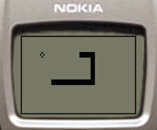
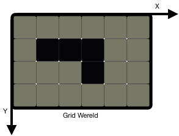
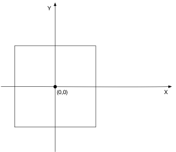

# Project Snake

Snake is een spel waarbij de speler de controle neemt over de richting waarin
een slang zich voortbeweegt. Een foto van het origineel spel kan je hieronder
zien. Vanuit implementatie standpunt beweegt de slang zich voort in een
gridwereld zoals hieronder weergeven. De slang beweegt zich autonoom vooruit,
en kan alleen horizontale of verticale stappen nemen. Periodiek komt er een
kleine cirkel op het scherm (die een appel voorstelt). Als de slang de appel
aanraakt verdwijnt de appel en krijgt de speler een punt. De slang wordt elke
seconde een blokje langer.

Deze opdracht bestaat eruit om een deel van het snake spel te implementeren in
Haskell. Hiervoor krijg je skelet code (minerva) die je moet aanvullen, deze
skeletcode bevat commentaar die samen met wat opzoekingswerk voldoende  is om
de opdracht af te werken. In dit document geven we je nog een beetje extra
informatie om aan de slag te kunnen gaan.

## Dependencies

In dit project maken we gebruik van twee bibliotheken. Om het installeren
hiervan eenvoudig te maken, voorzien we een [cabal] bestand, gegenereerd met
`stack new snake simple`. Je vindt dit [hier](snake.cabal) terug. De functie
van meeste velden in dit bestand zou duidelijk moeten zijn, en je kan deze dan
ook aanpassen naar eigen zin.

Onderaan staan de `build-depends` van het uitvoerbaar bestand `snake`
gespecifieerd. Deze worden automatisch geïnstalleerd als je

    stack build

uitvoert. Dit commando zal meteen ook je code compileren. [stack] installeer je
via je package-manager of je volgt de instructies in de README. Je code
uitvoeren kan je met

    stack build --exec snake

### Gloss Bibliotheek

Om te kunnen tekenen op het scherm zal je gebruik maken van een grafische
bibliotheek genaamd [gloss].

Het is deel van de opdracht dat je documentatie leest om de snake skelet code
af te werken. Om jullie wat werk te besparen geven we hier enkele hints:

* De oorsprong van het assenstelsel van gloss ligt in het midden van het scherm
  (+x is naar rechts en +y is naar boven).
* Als je een rechthoek maakt zal gloss deze tekenen in het midden van het
  scherm (zie onderstaande figuur).
* Het assenstelsel van de gridwereld is anders  dan het assenstelsel van gloss
  (je zal deze dus moeten omzetten)

### Random Bibliotheek

Om de appel steeds op een nieuwe positie te kunnen tekenen moeten we gebruik
maken van een random nummer generator. Deze wordt aangeleverd door de
bibliotheek [random].

## Tijdsbesteding

We verwachten dat je maximaal 4 uur tijd zal nodig hebben om dit eerste
projectje af te werken. Inbegrepen in deze tijd is opzoekingswerk om te weten
hoe Haskell werkt. Merk je dat je na één uur te werken vast zit en
opzoekingswerk moet verrichten dan is dit simpelweg onderdeel van de opdracht.
Merk je echter dat je veel meer tijd aan het spenderen bent dan 4 uur, vraag je
best om meer uitleg.

## Codeerstijl

Enkele aandachtspunten bij het schrijven van Haskell code die we verwachten van
jullie code:

* Geen hardgecodeerde constanten in je code.
* Vermijd het gebruik van if testen, maak gebruik van pattern matching en
  guards.
* Maak gebruik van where clauses voor locale functies.
* Probeer gebruik te maken van de reeds bestaande functies over lijsten.
* **Pas hlint toe op je code.**

Voldoet je code niet aan de verwachte code stijl zal je hiervoor punten
verliezen.

## Deadline

Je project moet ingediend worden vóór maandag 8 oktober 11 uur via Dodona (je
zal je project kunnen indienen vanaf maandag 1 oktober)

## Testen

Om ons werk te sparen tijdens het verbeteren, zorgen jullie er zelf voor dat
jullie projecten compileren. **Projecten die niet compileren krijgen
automatisch een nul.** Om een "maar op mijn machine werkte het wel..." te
vermijden, kan je altijd je project eens compileren in de standaard Haskell
docker. Loop onderstaand commando met je project als huidige map.

    docker run -it -v $(pwd):/mnt --workdir=/mnt --rm haskell:8 bash -c 'apt-get update; yes | apt-get install freeglut3-dev; stack build --allow-different-user'

Problemen kan je altijd (voor de deadline) melden.

[cabal]: https://www.haskell.org/cabal/
[stack]: https://docs.haskellstack.org/en/stable/README/
[gloss]: http://hackage.haskell.org/package/gloss
[random]: http://hackage.haskell.org/package/random-1.1
